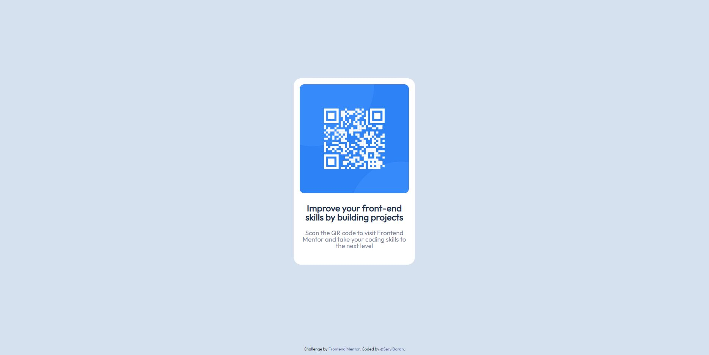

# Frontend Mentor - QR code component solution

This is a solution to the [QR code component challenge on Frontend Mentor](https://www.frontendmentor.io/challenges/qr-code-component-iux_sIO_H). Frontend Mentor challenges help you improve your coding skills by building realistic projects.

## Table of contents

- [Overview](#overview)
  - [Screenshot](#screenshot)
  - [Links](#links)
- [My process](#my-process)
  - [Built with](#built-with)
  - [Continued development](#continued-development)
  - [Useful resources](#useful-resources)
- [Author](#author)

## Overview

### Screenshot

### Links

- Solution URL: [Github Repository](https://github.com/SeryiBaran/qr-code-component)
- Live Site URL: [Github Pages](https://seryibaran.github.io/qr-code-component)

## My process

### Built with

- Semantic HTML5 markup
- Flexbox
- [Sass](https://sass-lang.com/) - CSS Preprocessor
- [Vite.js](https://vitejs.dev/) - Build Tool

### Useful resources

- [Deploying a subfolder to GitHub Pages](https://gist.github.com/cobyism/4730490) - This is an amazing article about deploy "dist" directory on Github Pages. I would recommend this to anyone who is still learning how to do it.

## Author

- Website - [Ivan Muzyka](https://seryibaran.github.io/)
- Frontend Mentor - [@SeryiBaran](https://www.frontendmentor.io/profile/SeryiBaran)
- Github - [@SeryiBaran](https://github.com/SeryiBaran)
